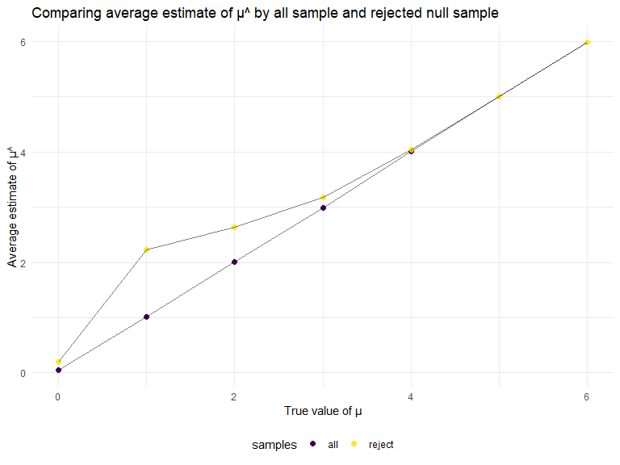

p8105_hw5_wm2460
================

## Problem 1

The code chunk below imports the data in individual spreadsheets
contained in `./data/zip_data/`. To do this, I create a dataframe that
includes the list of all files in that directory and the complete path
to each file. As a next step, I `map` over paths and import data using
the `read_csv` function. Finally, I `unnest` the result of `map`.

``` r
full_df = 
  tibble(
    files = list.files("data/zip_data/"),
    path = str_c("data/zip_data/", files)
  ) %>% 
  mutate(data = map(path, read_csv)) %>% 
  unnest()
```

The result of the previous code chunk isn’t tidy – data are wide rather
than long, and some important variables are included as parts of others.
The code chunk below tides the data using string manipulations on the
file, converting from wide to long, and selecting relevant variables.

``` r
tidy_df = 
  full_df %>% 
  mutate(
    files = str_replace(files, ".csv", ""),
    group = str_sub(files, 1, 3)) %>% 
  pivot_longer(
    week_1:week_8,
    names_to = "week",
    values_to = "outcome",
    names_prefix = "week_") %>% 
  mutate(week = as.numeric(week)) %>% 
  select(group, subj = files, week, outcome)
```

Finally, the code chunk below creates a plot showing individual data,
faceted by group.

``` r
tidy_df %>% 
  ggplot(aes(x = week, y = outcome, group = subj, color = group)) + 
  geom_point() + 
  geom_path() + 
  facet_grid(~group)
```


This plot suggests high within-subject correlation – subjects who start
above average end up above average, and those that start below average
end up below average. Subjects in the control group generally don’t
change over time, but those in the experiment group increase their
outcome in a roughly linear way.

## Problem 2

``` r
homicides_df = read_csv("./data/homicide-data.csv")
```

    ## Rows: 52179 Columns: 12
    ## ── Column specification ────────────────────────────────────────────────────────
    ## Delimiter: ","
    ## chr (9): uid, victim_last, victim_first, victim_race, victim_age, victim_sex...
    ## dbl (3): reported_date, lat, lon
    ## 
    ## ℹ Use `spec()` to retrieve the full column specification for this data.
    ## ℹ Specify the column types or set `show_col_types = FALSE` to quiet this message.

#### Describe the raw data

In the `homicides_df` dataset, there are 52179 observations and 12
variables. The variables in this dataset include uid, reported_date,
victim_last, victim_first, victim_race, victim_age, victim_sex, city,
state, lat, lon, disposition.

``` r
homicides_new = homicides_df %>% 
  janitor::clean_names() %>% 
  mutate(city_state = str_c(city, state, sep = "_"),
         status = 
           case_when(disposition == "Closed without arrest" ~ "unsolved",
                     disposition == "Open/No arrest" ~ "unsolved",
                     disposition == "Closed by arrest" ~ "resolved")) 

summarize_df = homicides_new %>% 
  group_by(city_state) %>% 
  summarize(total = n(),
            unsolved = sum(status == "unsolved")) 

summarize_df
```

    ## # A tibble: 51 × 3
    ##    city_state     total unsolved
    ##    <chr>          <int>    <int>
    ##  1 Albuquerque_NM   378      146
    ##  2 Atlanta_GA       973      373
    ##  3 Baltimore_MD    2827     1825
    ##  4 Baton Rouge_LA   424      196
    ##  5 Birmingham_AL    800      347
    ##  6 Boston_MA        614      310
    ##  7 Buffalo_NY       521      319
    ##  8 Charlotte_NC     687      206
    ##  9 Chicago_IL      5535     4073
    ## 10 Cincinnati_OH    694      309
    ## # … with 41 more rows

#### Using `prop.test` for Baltimore, MD

``` r
prop.test(summarize_df %>% filter(city_state == "Baltimore_MD") %>%
            pull(unsolved), 
          summarize_df %>% filter(city_state == "Baltimore_MD") %>%
            pull(total)) %>% 
  broom::tidy()
```

    ## # A tibble: 1 × 8
    ##   estimate statistic  p.value parameter conf.low conf.high method        alter…¹
    ##      <dbl>     <dbl>    <dbl>     <int>    <dbl>     <dbl> <chr>         <chr>  
    ## 1    0.646      239. 6.46e-54         1    0.628     0.663 1-sample pro… two.si…
    ## # … with abbreviated variable name ¹​alternative

``` r
# save the output of prop.test as an R object
prop.test(summarize_df %>% filter(city_state == "Baltimore_MD") %>%
            pull(unsolved), 
          summarize_df %>% filter(city_state == "Baltimore_MD") %>%
            pull(total)) %>% 
  broom::tidy() %>% 
  saveRDS(., "./data/Baltimore_prop_test.rds")
```

#### Using `prop.test` for each cities

``` r
all_cities = summarize_df %>% 
  mutate(prop_tests = map2(.x = unsolved, .y = total, ~ prop.test(x = .x, n = .y)),
         tidy_df = map(.x = prop_tests, ~ broom::tidy(.x))) %>% 
  select(-prop_tests) %>% 
  unnest(tidy_df) %>% 
  select(city_state, estimate, conf.low, conf.high)

all_cities
```

    ## # A tibble: 51 × 4
    ##    city_state     estimate conf.low conf.high
    ##    <chr>             <dbl>    <dbl>     <dbl>
    ##  1 Albuquerque_NM    0.386    0.337     0.438
    ##  2 Atlanta_GA        0.383    0.353     0.415
    ##  3 Baltimore_MD      0.646    0.628     0.663
    ##  4 Baton Rouge_LA    0.462    0.414     0.511
    ##  5 Birmingham_AL     0.434    0.399     0.469
    ##  6 Boston_MA         0.505    0.465     0.545
    ##  7 Buffalo_NY        0.612    0.569     0.654
    ##  8 Charlotte_NC      0.300    0.266     0.336
    ##  9 Chicago_IL        0.736    0.724     0.747
    ## 10 Cincinnati_OH     0.445    0.408     0.483
    ## # … with 41 more rows

#### A plot that shows the estimates and CIs for each city

``` r
all_cities_plot = all_cities %>% 
  mutate(city_state = fct_reorder(city_state, estimate)) %>% 
  ggplot(aes(x = city_state, y = estimate)) +
  geom_point() +
  geom_errorbar(aes(ymin = conf.low, ymax = conf.high)) + 
  theme(axis.text.x = element_text(angle = 90, vjust = 0.5, hjust = 1))

all_cities_plot
```


## Problem 3

#### Set up the simulation

``` r
# Start with a function that generate t-test results with fixed n and sigma

sim_1 = function(n = 30, mu = 0, sigma = 5) {
     x = rnorm(n, mean = mu, sd = sigma)
     t_test = t.test(x, conf.int = 0.95) %>% broom::tidy()
     
     t_test
}

p3_df = vector("list", 5000)

for (i in 1:5000) {
  p3_df[[i]] = sim_1()
}

p3_df %>% 
  bind_rows() %>% 
  head()
```

    ## # A tibble: 6 × 8
    ##   estimate statistic p.value parameter conf.low conf.high method         alter…¹
    ##      <dbl>     <dbl>   <dbl>     <dbl>    <dbl>     <dbl> <chr>          <chr>  
    ## 1   -0.518    -0.559   0.580        29    -2.41     1.38  One Sample t-… two.si…
    ## 2    0.417     0.367   0.716        29    -1.91     2.74  One Sample t-… two.si…
    ## 3   -1.25     -1.54    0.135        29    -2.91     0.411 One Sample t-… two.si…
    ## 4   -0.880    -0.947   0.352        29    -2.78     1.02  One Sample t-… two.si…
    ## 5   -1.28     -1.49    0.146        29    -3.03     0.471 One Sample t-… two.si…
    ## 6   -1.24     -1.39    0.174        29    -3.06     0.580 One Sample t-… two.si…
    ## # … with abbreviated variable name ¹​alternative

#### Simulation for different mu

``` r
# A second function to apply for-loop and calculate power

sim_2 = function(set){
  
  p3_df = vector("list", 5000)
  for (i in 1:5000) {
     p3_df[[i]] = sim_1(mu = set)
  }
  
  power = 
    p3_df %>% 
    bind_rows() %>% 
    janitor::clean_names() %>% 
    select(estimate, p_value) %>% 
    filter(p_value < 0.05) %>% 
    count()
  
  power
  
}

test_power =
  tibble(mus = c(0, 1, 2, 3, 4, 5, 6),
         reject_time = map(mus, sim_2)) %>%  
  unnest(reject_time) %>% 
  mutate(power = n/5000)
```

#### A plot between the power of the test and the true value of μ

``` r
power_plot = test_power %>% 
  ggplot(aes(x = mus, y = power)) +
  geom_point(aes(color = mus), size = 2) +
  geom_line(alpha = 0.3) +
  labs(x = "True value of μ",
       y = "Power of the test")

power_plot
```


From the plot, we can see clearly that the power of the test increase as
the true value of μ increase. Therefore, as the effect size (i.e., the
true value of μ) increase, power increases.

#### A plot showing the average estimate of μ^ and the true value of μ

``` r
# A third function to apply t-test and learn about when null was rejected

sim_3 = function(n = 30, mu = 0, sigma = 5) {
     sim_data = tibble(x = rnorm(n, mean = mu, sd = sigma),)
     
     sim_t_test = t.test(pull(sim_data,x), conf.int = 0.95) %>% 
              broom::tidy() %>% 
              janitor::clean_names() %>% 
              select(p_value)
     
     sim_data %>% 
     summarize(mu_hat_all = mean(x),
               mu_hat_rej = case_when(
                 pull(sim_t_test, p_value) < 0.05 ~ mean(x),
                 pull(sim_t_test, p_value) >= 0.05 ~ as.numeric("")))
}

# A forth function that apply sim_3 to the list and to summarize

sim_4 = function(set){
  mu_hat = vector("list", 5000)
  for (i in 1:5000) {
     mu_hat[[i]] = sim_3(mu = set)
     }
  
  mu_hat %>% 
    bind_rows() %>% 
    summarize(all = mean(mu_hat_all, na.rm = TRUE),
              reject = mean(mu_hat_rej, na.rm = TRUE))
}

average_muhat =
  tibble(true_mu = c(0, 1, 2, 3, 4, 5, 6),
         muhat = map(true_mu, sim_4)) %>%  
  unnest(muhat) %>% 
  pivot_longer(all:reject,
               names_to = "samples",
               values_to = "average")

all_plot = average_muhat %>% 
  filter(samples == "all") %>% 
  ggplot(aes(x = true_mu, y = average)) +
  geom_point(size = 2) +
  geom_line() +
  labs(x = "True value of μ",
       y = "Average estimate of μ^ of all sample")

all_plot
```


``` r
reject_plot = average_muhat %>% 
  filter(samples == "reject") %>% 
  ggplot(aes(x = true_mu, y = average)) +
  geom_point(size = 2) +
  geom_line() +
  labs(x = "True value of μ",
       y = "Average estimate of μ^ of rejected null sample")

reject_plot
```


``` r
together_plot = average_muhat %>% 
  ggplot(aes(x = true_mu, y = average, group = samples)) +
  geom_point(aes(color = samples), size = 2) +
  geom_line(alpha = 0.5) +
  labs(x = "True value of μ",
       y = "Average estimate of μ^",
       title = "Comparing average estimate of μ^ by all sample and rejected null sample")

together_plot
```



When the true μ is less than 4 and larger than 0, the sample average of
μ^ across tests for which the null is rejected is not approximately
equal to the true value of μ. However, if the true μ is 4, 5, or 6, the
sample average of μ^ across tests for which the null is rejected is
approximately equal to the true value of μ.

## End of HW5
